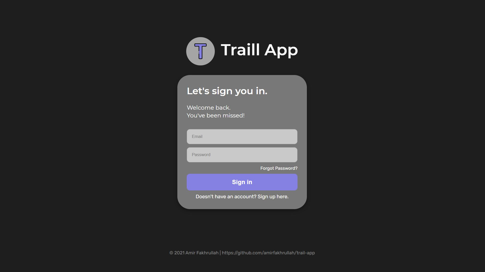
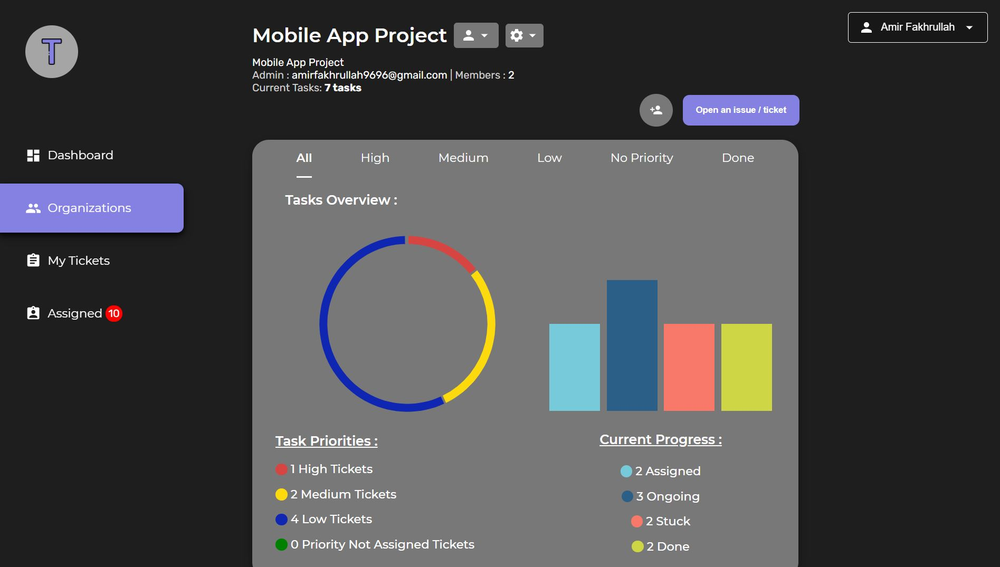

# Traill App

## Description

A bug tracking app - track the bugs and also the development of software/apps. (The code provided here is only the front-end code).

## Features

* Team/Organization friendly app - All bug issues (tickets) are grouped in organization id. A team member can assign a bug issue to other team members.
* Progress tracker - tracks the progress based on priority and status in dashboard page.
* Privacy protection - all teams/organizations created in the app are private. To join the team, the admin of the team has to invite the user and the user will receive an invitation link in their email ( which expires in 1 hour).
* Basic features - login, signup, reset password, CRUD request for users, organizations and tickets.

## Technologies

### Front-End

* React
* Redux
* Material UI
* React-Bootstrap
* JavaScript
* JSX
* CSS
* HTML

### Back-End (Code not provided here)

* REST APIs
* Express
* Node
* Nodemailer
* JWT
* MongoDB

### Deployment

* Back-End - Heroku
* Front-End - Vercel

## Ongoing / Future Works

* Clean-up and refactoring some codes.
* Mobile App version for smaller devices. (Current app doesn't support devices smaller than 500px width)
* Comment model for communication between team members
* Testing
* Lightmode & Darkmode toggle feature.